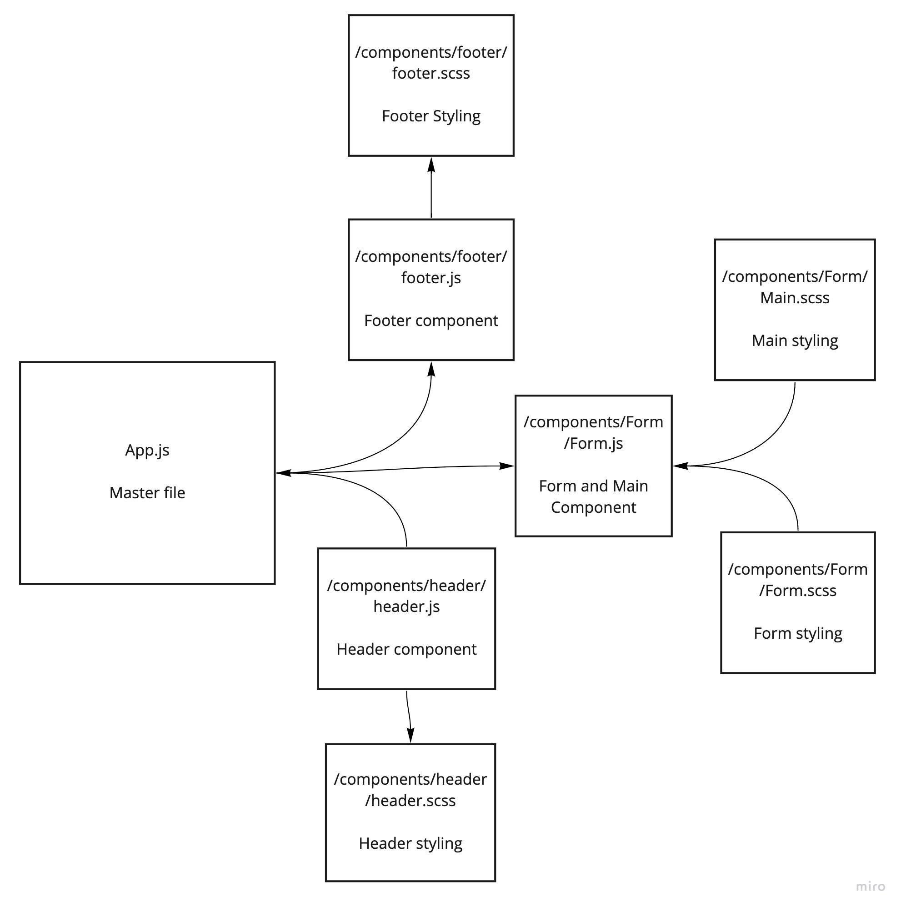
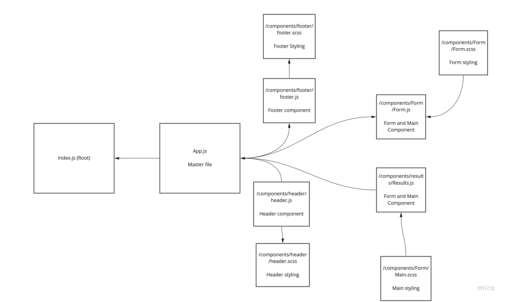

# RESTly

## Overview
## Lab 26
* This lab is the beginning of a project using React. Today's lab involved creating a page utilizing react components and scss styling.

## Lab 27
* Today is an add on to yesterday's lab in which we utilize props to pass variables in between components. 

## Code Sandbox
* https://codesandbox.io/s/flamboyant-tree-ko56g?file=/src/App.js

## UML 
### Day 1 Lab 26

### Day 2 Lab 27

