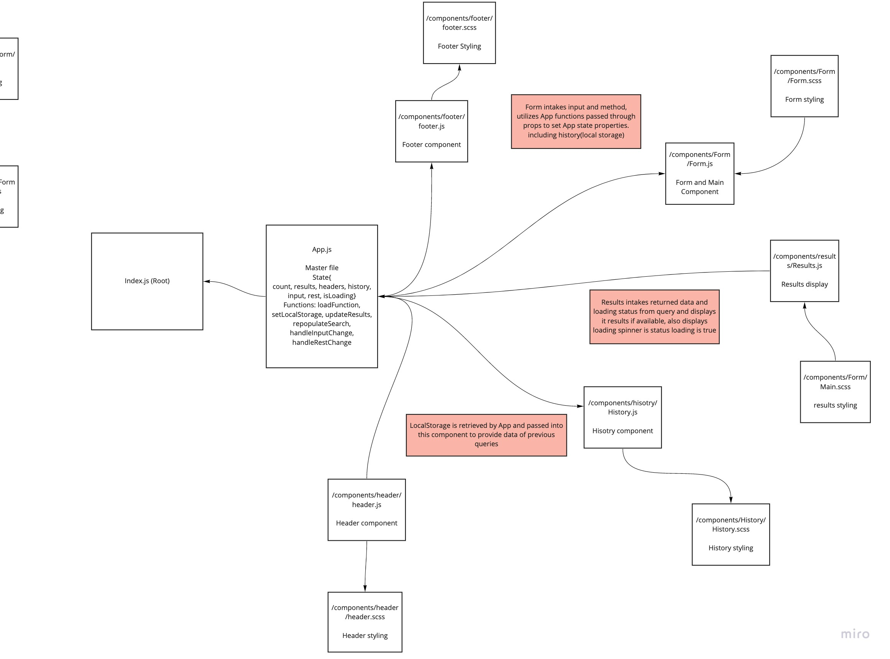
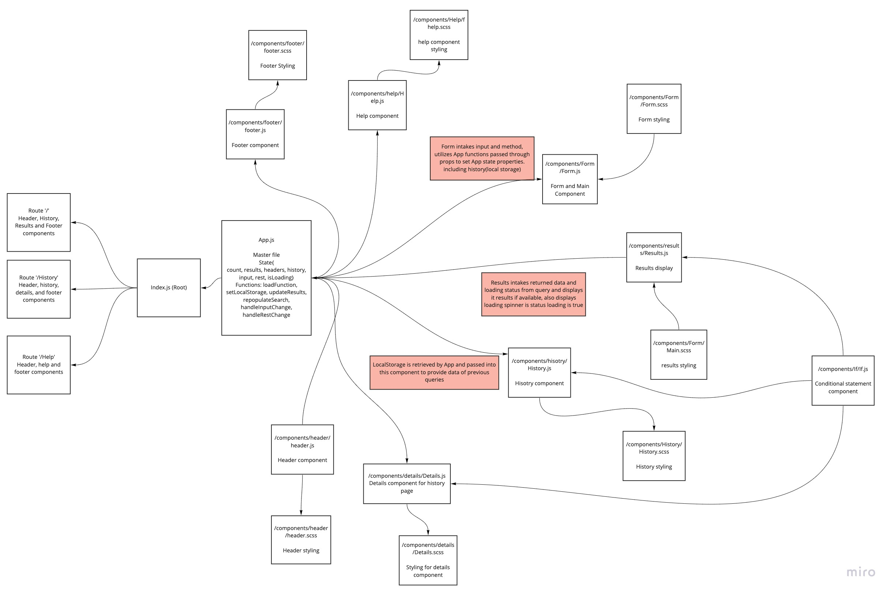

# RESTly

## Overview
## Lab 26
* This lab is the beginning of a project using React. Today's lab involved creating a page utilizing react components and scss styling.

## Lab 27
* Today is an add on to yesterday's lab in which we utilize props to pass variables in between components. 

## Lab 28
* A continuation of labs 26 & 27, adding a local storage component, loading spinner, and search autopopulation based on previous queries.

## Lab 29
* A continuation of labs 26, 27 & 28, adding route paths, nav links, and new components of help, if, and details

## Netlify
https://kind-kirch-014b3e.netlify.app/

## UML 
### Day 1 Lab 26

### Day 2 Lab 27

### Day 3 Lab 28

### Day 4 Lab 29

